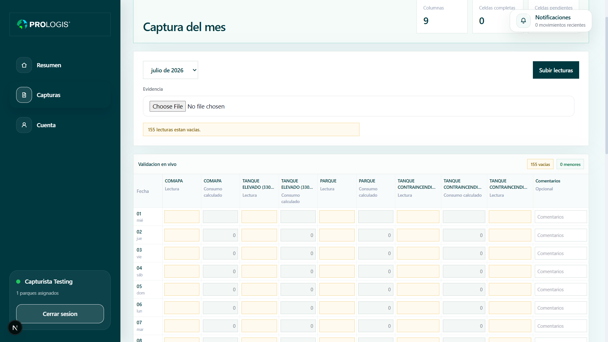
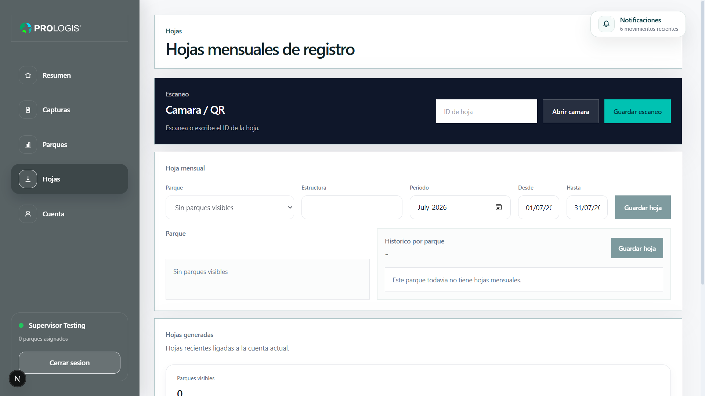
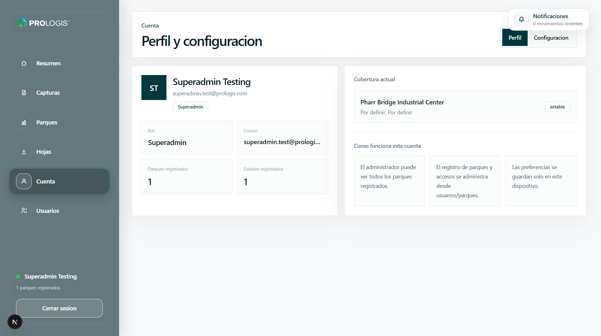
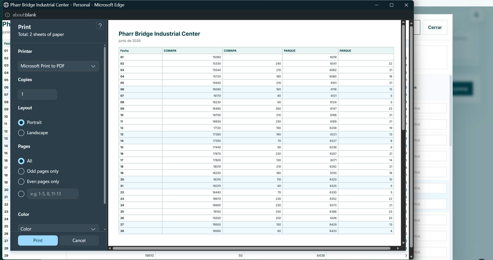

# Utility Readings Management PWA — Case Study

  
  
  
  
  

Case study of a role-based progressive web application created to centralize water and electricity readings, historical records and operational follow-up across multiple properties.

> **Portfolio notice:** This public repository contains project documentation and sanitized visuals only. Source code, credentials, internal records and implementation details are intentionally excluded.

## Overview

This project was developed as an internal pilot during my internship at **Prologis**. Its purpose was to replace a fragmented utility-reading workflow with a clearer digital experience for capturing, consulting and comparing operational information.

The application brings readings, historical imports and maintenance follow-up into a single responsive interface designed for different types of users.

## The challenge

Utility information can become difficult to review when readings are distributed across spreadsheets, reporting periods and individual properties. The project focused on making that information easier to capture, find and compare while respecting each user's level of access.

The main product goals were:

- Centralize water and electricity readings
- Organize records by property and reporting period
- Make historical information easier to consult
- Compare readings between periods
- Import existing records from Excel files
- Support role-based access to application functions
- Track readings and related maintenance incidents
- Provide a responsive experience for desktop and mobile use

## My contribution

I participated in the analysis, design and development of the pilot application. My work included:

- Translating an operational process into application screens and workflows
- Building responsive interfaces with Next.js, React and TypeScript
- Connecting application views to Supabase services
- Implementing experiences that adapt to user roles and permissions
- Supporting historical-data import and period-comparison workflows
- Organizing the capture and consultation of utility readings
- Testing the pilot and refining the interface based on its intended use
- Preparing technical documentation for the project

## Core capabilities

### Utility readings

- Capture water and electricity readings
- Consult records by property and period
- Review historical information from one interface
- Compare values across reporting periods

### Data continuity

- Import previously collected records from Excel
- Preserve access to historical information
- Reduce repeated manual consultation across separate files

### Access and operations

- Role-based views and permissions
- Maintenance-incident follow-up
- Responsive navigation across supported devices
- Centralized access to operational information

## Technology stack

| Area | Technology |
|---|---|
| Web framework | Next.js, React |
| Language | TypeScript |
| Styling | Tailwind CSS |
| Data and services | Supabase |
| Application type | Progressive Web App (PWA) |
| Development workflow | Git, npm |

## Product flow

1. An authorized user accesses the application.
2. The interface presents the options available for that user's role.
3. The user captures a new reading or consults existing records.
4. Historical information can be filtered and compared by reporting period.
5. Related operational incidents can be reviewed as part of the workflow.

## Design priorities

- **Clarity:** present operational data without unnecessary complexity
- **Consistency:** use repeatable patterns for capture, consultation and comparison
- **Responsiveness:** support practical use across different screen sizes
- **Traceability:** preserve historical context when reviewing information
- **Controlled access:** adapt available actions to each user role

## Visual preview

The following screenshots use fictional demonstration data and illustrate the main application workflows.

### Monthly reading capture

  

  Monthly data capture with live validation, calculated consumption fields and evidence uploads.

### Monthly sheets and QR workflow

  

  QR-assisted access, reporting-period selection and monthly record organization.

### Role-based administration

  

  Administrator account with role information, property coverage and permission-specific navigation.

### Printable utility report

  

  Structured monthly utility records prepared for review, printing or PDF export.

## Outcome

The project was delivered as an internal pilot that demonstrates how a recurring operational process can be transformed into a centralized web workflow.

Because this is a portfolio case study, no unverified performance metrics or production-usage claims are included. Future updates may add measurable outcomes only when they can be shared and verified.

## Privacy and repository scope

This repository intentionally does **not** include:

- Application source code
- Environment files or credentials
- Supabase project identifiers or private configuration
- Database schemas, migrations or access policies
- Internal property, employee or customer information
- Real utility readings, spreadsheets or maintenance records
- Company documents, certificates, evidence files or backups
- Internal URLs, screenshots with identifiable data or proprietary branding assets

The content is limited to a high-level description of the problem, my contribution, the technology stack and sanitized interface previews.

## What I learned

This project strengthened my experience with:

- Building responsive applications with Next.js and TypeScript
- Structuring interfaces around real operational workflows
- Connecting frontend experiences with Supabase services
- Designing role-aware application behavior
- Presenting historical data and period comparisons clearly
- Turning business requirements into maintainable product features
- Documenting a private project responsibly for a technical portfolio

## Author

**Carlos Constantino**  
Junior Frontend Developer

- Portfolio: https://portafoliofrann.netlify.app/
- LinkedIn: https://www.linkedin.com/in/fcoocarlos/
- GitHub: https://github.com/frannnkkyy

## Disclaimer

This case study is presented for portfolio purposes. It is not an official Prologis product page, and no affiliation, endorsement or ownership of company branding is implied.
